# Play store listing

## Main store listing

### App Name

#### en-US

Location Simulator

#### de-DE

Ortungssimulator

### Short Description

#### en-US

An app for the training of USAR personnel

#### de-DE

Eine App zum Training von USAR-Einsatzkräften

### Full description

#### en-US

<b>Location Simulator</b> is an app for the training of Urban Search and Rescue (USAR) personnel in the operation of acoustic equipment for locating persons in collapsed structures. 

Personnel is trained in the operation of this equipment by placing an Android smartphone into a rubble structure. The phone will periodically vibrate using the vibration motor and/or generate audible signals from audio recording (e.g. calling out for help, or moaning), so that the personnel being trained can precisely locate the phone within the structure. This app can thus replace existing training aids such as automatic "knocking devices" or cell phones numbers being dialled by the trainers.

The app <b>Location Simulator</b> was developed as a student project at the University of Luebeck, Germany, in collaboration with volunteers in the German Federal Agency for Technical Relief. The continued development of the app was handed over to one of these volunteers. The German Federal Agency for Technical Relief was not otherwise involved in and is not otherwise affiliated with the development of the application.

The source code of the application is available on GitHub and licensed under the terms of the Apache-2 license: https://github.com/isp-group-locationsimulator/Location-Simulator.

#### de-DE

<b>Ortungssimulator<b> ist eine App zum Training von Einsatzkräften im Bereich von <i>Urban Search and Rescue<i> (USAR) im Umgang mit akustischer Ortungstechnik, um verschüttete Personen zu lokalisieren.

Die Einsatzkräfte werden in der Verwendung mit der Ausstattung geschult, indem ein Android-Smartphone in einem Trümmerkegel platziert wird. Das Smartphone wird periodisch vibrieren und/oder hörbare Signale (z.B. Rufe nach Hilfe oder Stöhnen) abgegben. So können die Einsatzkräfte die Lage des Handys genau lokalisieren. Somit kann die App bereits existierende Trainingsmittel wie automatische "Klopfer" oder ad-hoc-Lösungen wie kontinuierliche Anrufe an ein verstecktes Smartphone effektiv ersetzen und ergänzen.

Die App <b>Ortungssimulator</b> wurde als studentisches Projekt an der Universitätz zu Lübeck in Zusammenarbeit mit ehrenamtlichen Einsatzkräften in der Bundesanstalt Technisches Hilfswerk entwickelt. Nach Abschluss des studentischen Projekts wurde die App zur Weiterentwicklung und -pflege an die beteiligten Einsatzkräfte übergeben. Die Bundesanstalt Technisches Hilfswerk ist darüber hinaus nicht in die Entwicklung der App eingebunden und mit der App nicht affiliiert.

Der Quellcode der App ist auf GitHub verfügbar und mittels Apache-2 lizensiert: https://github.com/isp-group-locationsimulator/Location-Simulator.

## Screenshots

### 01 Start screen

|en-US|de-DE|
|-|-|
|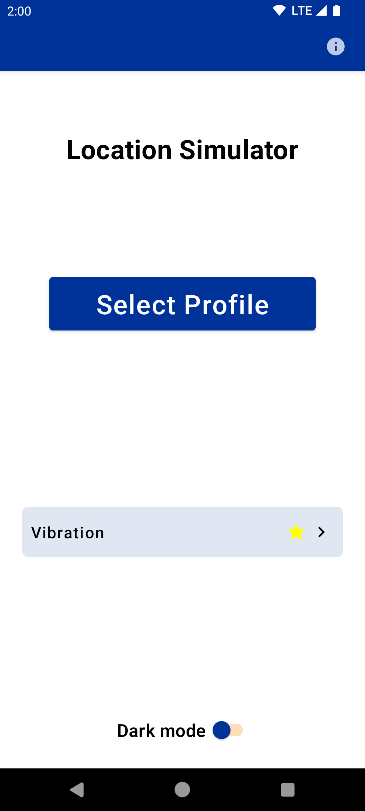|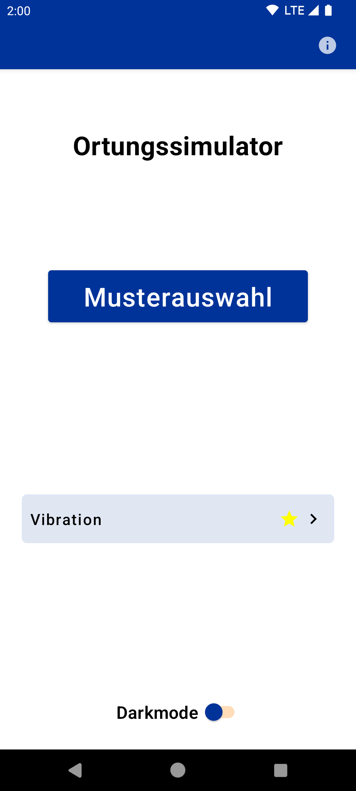|

### 02 Create configuration

|en-US|de-DE|
|-|-|
|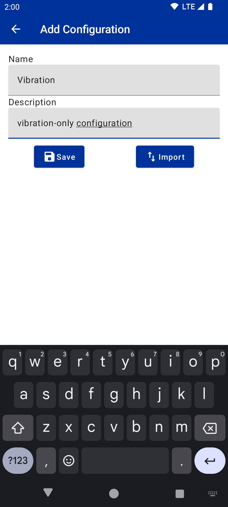|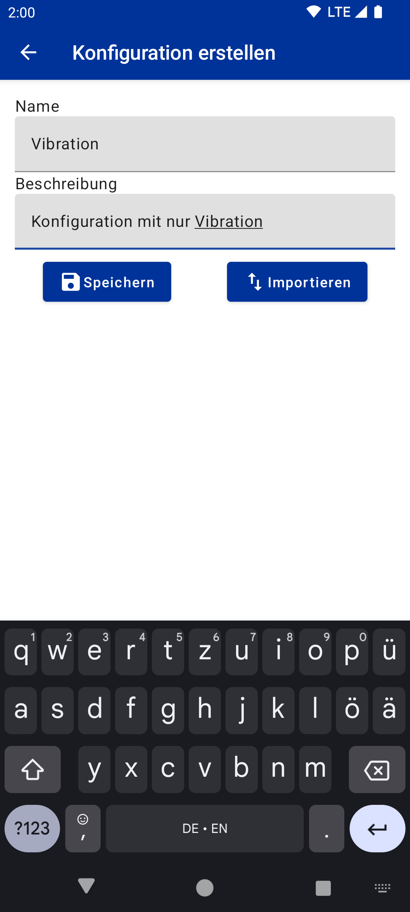|

### 03 Select screen

|en-US|de-DE|
|-|-|
|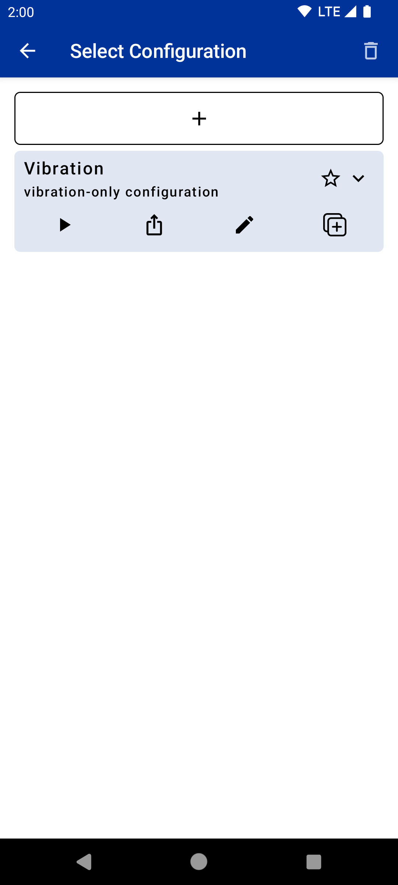|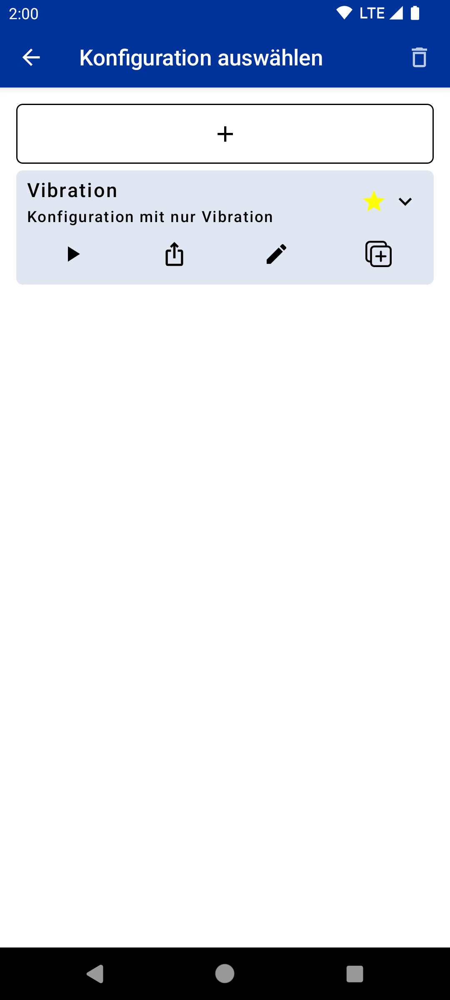|

### 04 Edit configuration

|en-US|de-DE|
|-|-|
|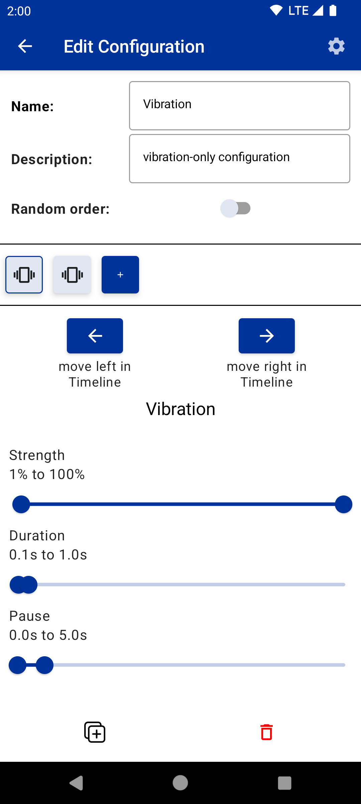|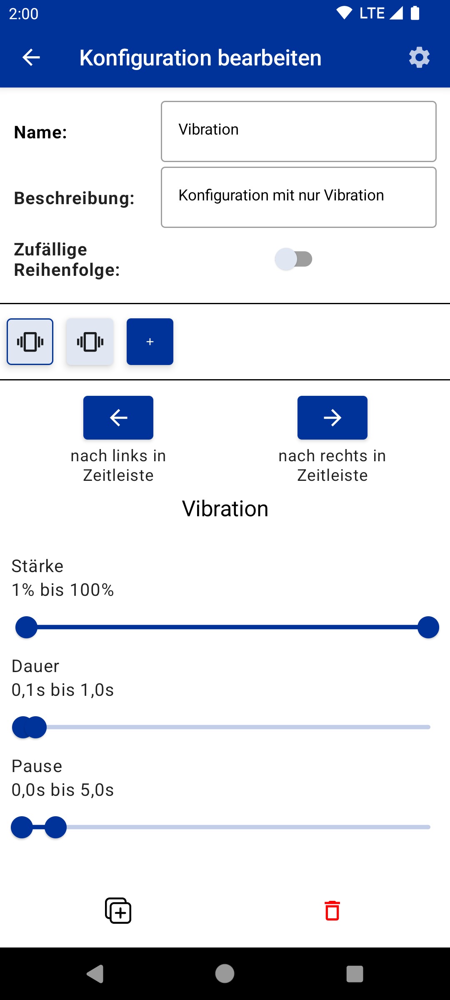|

### 05 Edit add

|en-US|de-DE|
|-|-|
|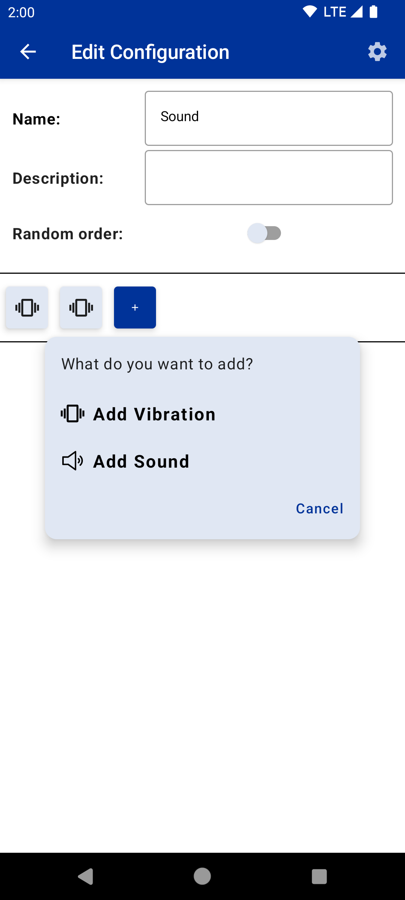|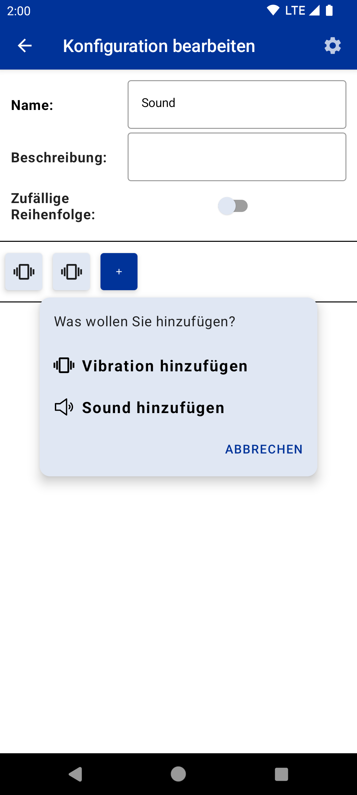|

### 06 Edit select sound

|en-US|de-DE|
|-|-|
|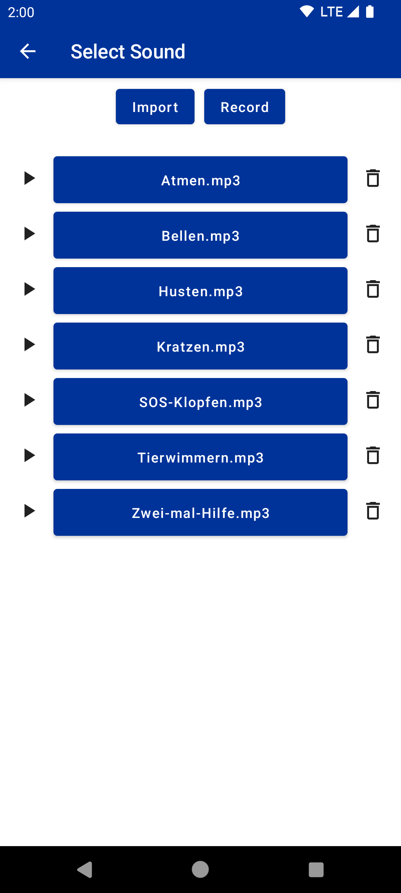|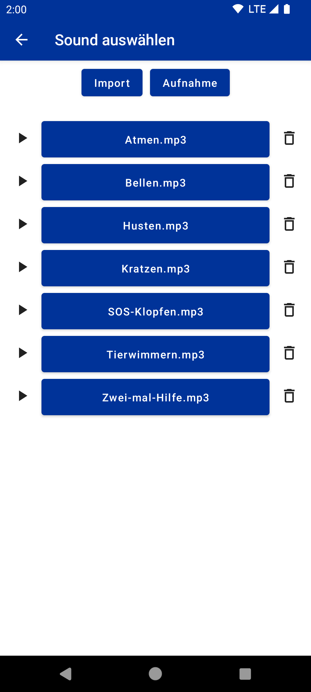|

### 07 Start configuration

|en-US|de-DE|
|-|-|
|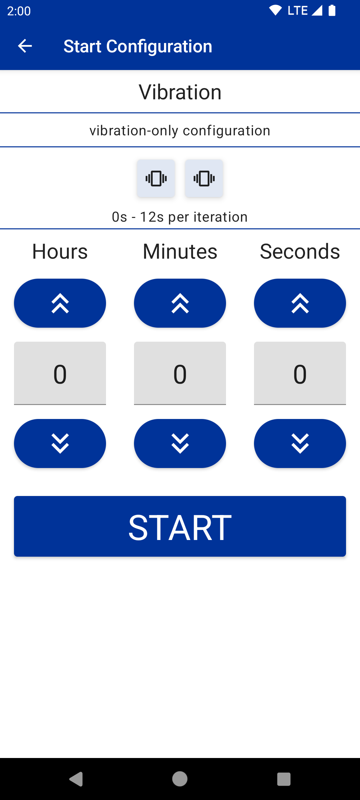|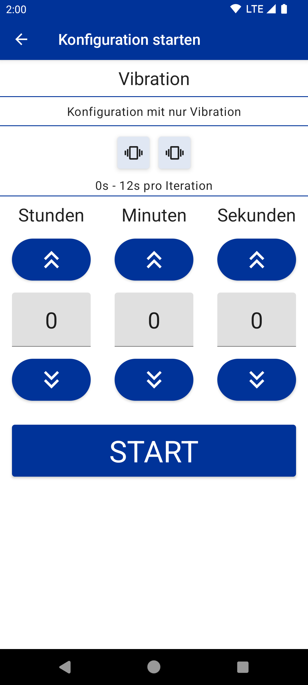|